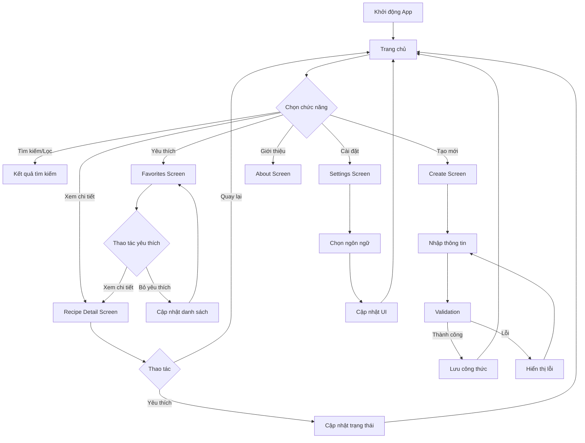

# RECIPE BOOK APP - BÁO CÁO PHÂN TÍCH VÀ THIẾT KẾ

---

## PHẦN 1: SRS (SOFTWARE REQUIREMENTS SPECIFICATION)

### 1.1. Tổng quan ứng dụng

**Recipe Book** là một ứng dụng di động được phát triển bằng Flutter, giúp người dùng khám phá, tạo mới và quản lý các công thức nấu ăn yêu thích. Ứng dụng hỗ trợ đa ngôn ngữ (Tiếng Việt và Tiếng Anh) với giao diện hiện đại và thân thiện.

### 1.2. Các chức năng chính

#### 1.2.1. Chức năng Trang chủ (Home Screen)
- **Mục đích**: Hiển thị danh sách tất cả công thức nấu ăn
- **Tính năng**:
  - Xem danh sách công thức dạng grid responsive
  - Tìm kiếm công thức theo tên và mô tả
  - Lọc theo danh mục (Tất cả, Món chính, Khai vị, Ăn vặt)
  - Thu gọn/mở rộng phần header tìm kiếm
  - Thêm/xóa công thức yêu thích
  - Xem chi tiết công thức

#### 1.2.2. Chức năng Yêu thích (Favorites Screen)
- **Mục đích**: Quản lý danh sách công thức yêu thích
- **Tính năng**:
  - Hiển thị chỉ các công thức đã được đánh dấu yêu thích
  - Tìm kiếm và lọc trong danh sách yêu thích
  - Xóa khỏi danh sách yêu thích
  - Badge hiển thị số lượng công thức yêu thích trên navigation bar

#### 1.2.3. Chức năng Tạo công thức (Create Screen)
- **Mục đích**: Cho phép người dùng tạo công thức mới
- **Tính năng**:
  - Nhập thông tin cơ bản: tên (2 ngôn ngữ), mô tả, hình ảnh
  - Chọn thời gian nấu, số người ăn, độ khó, danh mục
  - Thêm/xóa nguyên liệu động (hỗ trợ 2 ngôn ngữ)
  - Thêm/xóa các bước thực hiện (hỗ trợ 2 ngôn ngữ)
  - Validation form đầy đủ
  - Lưu công thức vào danh sách chung

#### 1.2.4. Chức năng Chi tiết công thức (Recipe Detail Screen)
- **Mục đích**: Hiển thị thông tin chi tiết của một công thức
- **Tính năng**:
  - Hiển thị hình ảnh full-screen với SliverAppBar
  - Thông tin chi tiết: thời gian, số người, độ khó
  - Danh sách nguyên liệu với bullet points
  - Các bước thực hiện với số thứ tự
  - Nút yêu thích floating trên hình ảnh

#### 1.2.5. Chức năng Cài đặt (Settings Screen)
- **Mục đích**: Tùy chỉnh cài đặt ứng dụng
- **Tính năng**:
  - Chuyển đổi ngôn ngữ (Tiếng Việt/Tiếng Anh)
  - UI cập nhật real-time khi thay đổi ngôn ngữ

#### 1.2.6. Chức năng Giới thiệu (About Screen)
- **Mục đích**: Thông tin về ứng dụng và nhà phát triển
- **Tính năng**:
  - Thông tin ứng dụng và các tính năng
  - Hồ sơ nhà phát triển với avatar
  - Danh sách kỹ năng dạng chip
  - Các dự án đã thực hiện
  - Liên kết đến email, GitHub, Facebook

### 1.3. Luồng hoạt động chính



### 1.4. Yêu cầu phi chức năng

#### 1.4.1. Hiệu năng
- Thời gian khởi động: < 2 giây
- Thời gian chuyển màn hình: < 500ms
- Smooth scrolling và animation

#### 1.4.2. Giao diện người dùng
- Responsive design cho mọi kích thước màn hình
- Hỗ trợ orientation landscape/portrait
- Material Design 3 guidelines
- Animation mượt mà với flutter_animate

#### 1.4.3. Khả năng sử dụng
- Hỗ trợ đa ngôn ngữ hoàn chỉnh
- Giao diện trực quan, dễ sử dụng
- Feedback người dùng qua SnackBar
- Error handling và validation

#### 1.4.4. Khả năng mở rộng
- Kiến trúc modular dễ bảo trì
- State management đơn giản với StatefulWidget
- Cấu trúc thư mục rõ ràng

---

## PHẦN 2: SAD (SOFTWARE ARCHITECTURE DESIGN)

### 2.1. Kiến trúc tổng quan

Ứng dụng sử dụng kiến trúc **Layer Architecture** đơn giản với Flutter, bao gồm:

```
┌─────────────────────────────────┐
│        PRESENTATION LAYER        │
│    (Screens & UI Components)     │
├─────────────────────────────────┤
│         BUSINESS LAYER          │
│     (Models & State Logic)      │
├─────────────────────────────────┤
│          DATA LAYER             │
│    (Static Data & Utilities)    │
└─────────────────────────────────┘
```

### 2.2. Cấu trúc thư mục

```
lib/
├── main.dart                 # Entry point & Material App
├── models/                   # Data models & business logic
│   ├── recipe.dart          # Recipe model & sample data
│   └── app_state.dart       # Global state management
├── screens/                  # UI screens
│   ├── home_screen.dart     # Trang chủ
│   ├── favorites_screen.dart # Trang yêu thích
│   ├── create_screen.dart   # Tạo công thức
│   ├── recipe_detail_screen.dart # Chi tiết công thức
│   ├── settings_screen.dart # Cài đặt
│   └── about_screen.dart    # Giới thiệu
└── utils/                   # Utilities & helpers
    └── translations.dart    # Đa ngôn ngữ
```

### 2.3. Thiết kế chi tiết các lớp

#### 2.3.1. Model Layer

##### Recipe Model
```dart
class Recipe {
  final String id;
  final String nameVi, nameEn;
  final String descriptionVi, descriptionEn;
  final String imageUrl;
  final int duration, servings;
  final String difficulty; // 'easy', 'medium', 'hard'
  final String category;   // 'main', 'appetizer', 'snack'
  final List<String> ingredientsVi, ingredientsEn;
  final List<String> stepsVi, stepsEn;
  
  // Helper methods cho đa ngôn ngữ
  String getName(String language);
  String getDescription(String language);
  List<String> getIngredients(String language);
  List<String> getSteps(String language);
}
```

##### AppState (Global State)
```dart
class AppState {
  static String language = 'vi';
  static List<Recipe> favoriteRecipes = [];
  static List<Recipe> allRecipes = [];
  
  // Business logic methods
  static bool isFavorite(Recipe recipe);
  static void toggleFavorite(Recipe recipe);
  static void addRecipe(Recipe recipe);
}
```

#### 2.3.2. Presentation Layer

##### Main App Structure
```dart
RecipeBookApp (MaterialApp)
└── MobileFrame (StatefulWidget)
    ├── BottomNavigationBar (5 tabs)
    └── Screen Stack:
        ├── HomeScreen
        ├── FavoritesScreen  
        ├── CreateScreen
        ├── SettingsScreen
        └── AboutScreen
```

##### Screen Components

**HomeScreen & FavoritesScreen**:
- Shared UI patterns: Search bar, Category filter, Recipe grid
- Responsive GridView với orientation detection
- Collapsible header với AnimatedContainer
- Recipe cards với thông tin đầy đủ

**CreateScreen**:
- Form-based UI với validation
- Dynamic lists cho ingredients/steps
- Sectioned layout với containers
- Multi-language input support

**RecipeDetailScreen**:
- SliverAppBar với parallax image
- Custom ScrollView layout
- Ingredient list với custom bullets
- Numbered instruction steps

### 2.4. State Management

#### 2.4.1. Local State
- Sử dụng StatefulWidget với setState()
- Quản lý UI state: search queries, form data, selections

#### 2.4.2. Global State  
- AppState class với static members
- Simple state management phù hợp với app scope nhỏ
- Real-time UI updates khi state thay đổi

#### 2.4.3. State Flow
```mermaid
graph LR
    A[User Action] --> B[setState()]
    B --> C[Widget Rebuild]
    C --> D[UI Update]
    
    E[Global Action] --> F[AppState Update]
    F --> G[Dependent Widgets Rebuild]
    G --> H[UI Sync]
```

### 2.5. Data Management

#### 2.5.1. Static Data
- Sample recipes trong `recipe.dart`
- Translation strings trong `translations.dart`
- Hardcoded data phù hợp cho prototype/demo

#### 2.5.2. Runtime Data
- User-created recipes được lưu trong memory
- Favorite status được track trong AppState
- No persistence - data reset mỗi lần restart app

### 2.6. UI/UX Design Patterns

#### 2.6.1. Material Design 3
- Sử dụng Material 3 theming
- Consistent color scheme (black/white/gray)
- Proper elevation và shadows

#### 2.6.2. Responsive Design
```dart
// Orientation-based layout
final isLandscape = MediaQuery.of(context).orientation == Orientation.landscape;
final crossAxisCount = isLandscape ? 2 : 1;
```

#### 2.6.3. Animation & Transitions
- flutter_animate cho micro-interactions
- AnimatedContainer cho smooth state changes
- Hero transitions (implicit với Navigator)

### 2.7. Internationalization (i18n)

#### 2.7.1. Translation System
```dart
// Centralized translation map
final Map<String, Map<String, String>> appStrings = {
  'vi': { 'key': 'Giá trị tiếng Việt' },
  'en': { 'key': 'English value' }
};

// Usage pattern
Text(appStrings[AppState.language]!['key']!)
```

#### 2.7.2. Real-time Language Switching
- Global language state trong AppState
- Automatic UI refresh khi thay đổi ngôn ngữ
- Complete app re-rendering với setState()

### 2.8. Navigation Architecture

#### 2.8.1. Bottom Tab Navigation
```dart
// Tab-based navigation structure
BottomNavigationBar với 5 tabs:
- Home (HomeScreen)
- Favorites (FavoritesScreen) 
- Create (CreateScreen)
- Settings (SettingsScreen)
- About (AboutScreen)
```

#### 2.8.2. Modal Navigation
```dart
// Push navigation cho detail screen
Navigator.push(
  context,
  MaterialPageRoute(
    builder: (context) => RecipeDetailScreen(recipe: recipe)
  )
);
```

### 2.9. Performance Considerations

#### 2.9.1. Efficient Rendering
- ListView.builder cho dynamic lists
- GridView.builder cho recipe grids
- Image caching với Network.image

#### 2.9.2. Memory Management
- Proper TextEditingController disposal
- Widget tree optimization
- Minimal state retention

### 2.10. Error Handling & Validation

#### 2.10.1. Form Validation
```dart
// User input validation
if (fieldValue.isEmpty) {
  ScaffoldMessenger.of(context).showSnackBar(
    SnackBar(content: Text('Error message'))
  );
}
```

#### 2.10.2. Image Loading
```dart
// Graceful image error handling
Image.network(
  imageUrl,
  errorBuilder: (context, error, stackTrace) {
    return Container(
      color: Colors.grey.shade300,
      child: Icon(Icons.restaurant)
    );
  }
);
```

---

## KẾT LUẬN

Ứng dụng Recipe Book được thiết kế với kiến trúc đơn giản nhưng hiệu quả, phù hợp cho một ứng dụng demo/prototype. Các điểm mạnh:

### Ưu điểm:
1. **Kiến trúc rõ ràng**: Phân tách rõ ràng giữa UI, business logic và data
2. **Responsive design**: Hỗ trợ đa thiết bị và orientation
3. **Internationalization**: Đa ngôn ngữ hoàn chỉnh
4. **User Experience**: Giao diện hiện đại, animation mượt mà
5. **Code organization**: Cấu trúc thư mục logic, dễ bảo trì

### Khả năng mở rộng:
1. **Database integration**: Có thể tích hợp SQLite/Hive cho persistence
2. **API integration**: Kết nối với backend cho sync data
3. **State management**: Upgrade lên Provider/Bloc cho complex state
4. **Features**: Thêm chức năng share, rating, user accounts
5. **Platform**: Deploy lên iOS/Android stores

Ứng dụng thể hiện được các nguyên tắc thiết kế mobile app tốt với Flutter framework, suitable cho việc học tập và phát triển tiếp theo.